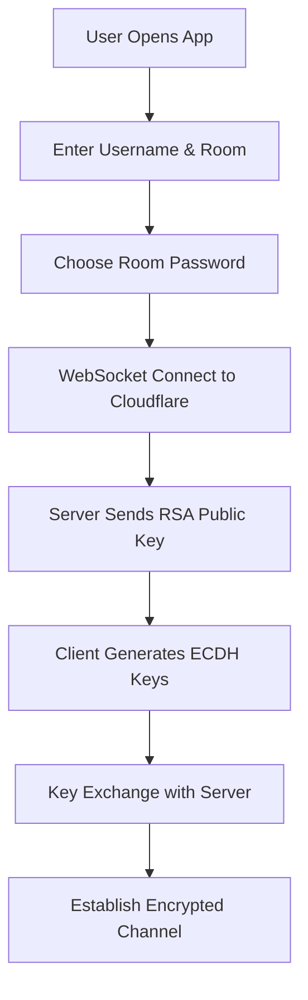
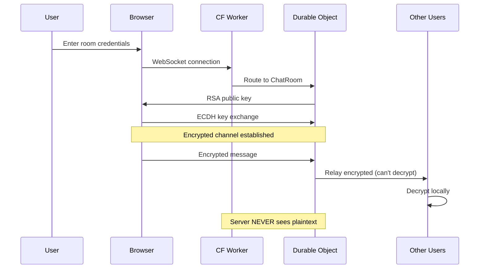

# 🏗️ NodeCrypt Project Architecture & Flow

## 📁 Project Structure Overview

```
NodeCrypt/
├── 🌐 **Cloudflare Workers Backend**
│   ├── worker/
│   │   ├── index.js          # Main worker entry (handles HTTP & WebSocket upgrade)
│   │   └── utils.js          # Encryption utilities
│   │
│   └── wrangler.toml         # Cloudflare Workers configuration
│       - Durable Objects: ChatRoom (persistent chat state)
│       - Assets binding: Serves frontend files
│
├── 🎨 **Frontend Application**
│   ├── client/
│   │   ├── index.html        # Main entry point
│   │   ├── js/
│   │   │   ├── main.js       # App initialization
│   │   │   ├── NodeCrypt.js  # Core encryption module
│   │   │   ├── chat.js       # Chat functionality
│   │   │   ├── room.js       # Room management
│   │   │   └── ui.js         # UI components
│   │   └── css/              # Styling
│   │
│   └── dist/                 # Built frontend (served by Workers)
│
├── 🏥 **HIPAA Medical Extensions** (Added by you)
│   ├── client/js/
│   │   ├── HIPAAMedicalChat.js      # Medical consultation system
│   │   ├── HIPAAWebRTCApp.js        # Video calling integration
│   │   ├── encryption/
│   │   │   └── SignalProtocolManager.js  # Signal Protocol E2EE
│   │   ├── webrtc/
│   │   │   └── SecureWebRTC.js      # Encrypted video/audio
│   │   └── queue/
│   │       └── SecureQueueManager.js # Patient queue management
│   │
│   └── server/               # Standalone Node.js servers (optional)
│       ├── queue-server.js   # Queue WebSocket server
│       └── server.js         # Alternative backend
│
└── 🧪 **Testing & Documentation**
    ├── test-*.js             # Test files
    ├── *.html                # Demo/test interfaces
    └── docs/                 # Architecture documentation
```

---

## 🔐 Authentication & Encryption Flow

### 1️⃣ **Initial Connection (No Traditional Auth!)**

This project uses **zero-knowledge architecture** - there's NO traditional authentication:



**Key Points:**
- ✅ **No user accounts** - just pick a username
- ✅ **No registration/login** - completely anonymous
- ✅ **Room password** becomes part of encryption key
- ✅ **Server never knows passwords** or user identities

### 2️⃣ **Three-Layer Encryption System**

```
Layer 1: RSA-2048 (Server Identity)
   ↓
Layer 2: ECDH-P384 (Key Agreement)  
   ↓
Layer 3: AES-256 + ChaCha20 (Message Encryption)
```

---

## 🌐 How Cloudflare Workers Handle Everything

### **Request Flow:**

```javascript
// worker/index.js - Main entry point
export default {
  async fetch(request, env, ctx) {
    // 1. WebSocket upgrade for chat
    if (request.headers.get('Upgrade') === 'websocket') {
      return env.CHAT_ROOM.fetch(request);  // Durable Object handles it
    }
    
    // 2. API requests
    if (url.pathname.startsWith('/api/')) {
      // Handle API logic
    }
    
    // 3. Static files (HTML, JS, CSS)
    return env.ASSETS.fetch(request);  // Serves dist/ folder
  }
}
```

### **Durable Objects (ChatRoom):**
- Persistent chat room state
- Manages connected clients
- Routes encrypted messages
- No message storage (zero-knowledge)

---

## 🔄 Complete User Journey

### **Step 1: User Enters Room**
```javascript
// client/js/main.js
1. User enters: Username + Room Name + Password
2. Click "Join Room"
3. Triggers: loginFormHandler() → joinRoom()
```

### **Step 2: Establish Secure Connection**
```javascript
// client/js/NodeCrypt.js
1. WebSocket connects to Cloudflare Worker
2. Receive server's RSA public key
3. Generate client ECDH keys
4. Exchange keys with server
5. Derive shared secret: ECDH + SHA256(room_password)
```

### **Step 3: Join Chat Room**
```javascript
// worker/index.js → ChatRoom class
1. Server validates encrypted join request
2. Adds client to room
3. Broadcasts "user joined" to all members
4. Client receives member list
```

### **Step 4: Send/Receive Messages**
```javascript
// Sending:
User types → Encrypt with ChaCha20 → Send to server → Server relays (can't decrypt)

// Receiving:
Server relays → Decrypt with ChaCha20 → Display in chat
```

### **Step 5: Private Chat (Click Avatar)**
```javascript
1. Click user avatar
2. Establish P2P encrypted channel
3. Messages only between two users
4. Server and others can't decrypt
```

---

## 🏥 HIPAA Medical Extensions (Your Additions)

You've extended the base system with medical features:

### **Medical Chat Flow:**
```
HIPAAMedicalChat.initialize()
    ↓
SignalProtocol + WebRTC setup
    ↓
Start consultation (video/chat)
    ↓
Queue management for patients
    ↓
Encrypted medical communication
```

### **Key Medical Features:**
1. **Signal Protocol** - Medical-grade E2EE
2. **WebRTC** - Encrypted video consultations
3. **Queue System** - Patient waiting management
4. **HIPAA Compliance** - Audit logs, no PHI exposure

---

## 🚀 Deployment Architecture

```
User Browser
     ↓
Cloudflare CDN (Global)
     ↓
Cloudflare Workers (Edge)
     ↓
Durable Objects (State)
```

**Benefits:**
- ⚡ **Edge computing** - runs near users globally
- 🔒 **No central server** - distributed architecture  
- 💾 **No database** - ephemeral, memory-only
- 🌍 **Global scale** - Cloudflare's network

---

## 📊 Data Flow Summary



---

## 🎯 Core Principles

1. **Zero-Knowledge**: Server can't decrypt anything
2. **No Storage**: Messages exist only in transit
3. **Anonymous**: No user accounts or tracking
4. **Ephemeral**: Everything disappears when you leave
5. **Transparent**: See who's in the room in real-time

---

## 🔑 What Happens After "Authentication"?

Since there's **no real authentication**, here's what happens:

1. **Room Entry** = Authentication
   - Room password is your "auth token"
   - Wrong password = can't decrypt messages

2. **Encryption Keys** = Your Identity
   - Each session gets unique keys
   - Keys deleted when you disconnect

3. **Message Routing** = By Room Name
   - Server groups clients by room
   - Can't see messages from other rooms

4. **Privacy** = Built-in by Design
   - No user profiles
   - No message history
   - No tracking

This is a **privacy-first, zero-trust** architecture where the server is intentionally "dumb" and clients handle all intelligence locally!

---

*The beauty of NodeCrypt: It uses Cloudflare's infrastructure for global scale while maintaining complete privacy through client-side encryption.*