# System Design Document
## HIPAA Medical Chat with Queue Management
### Object Model and Architecture Design

---

## 1. System Architecture Overview

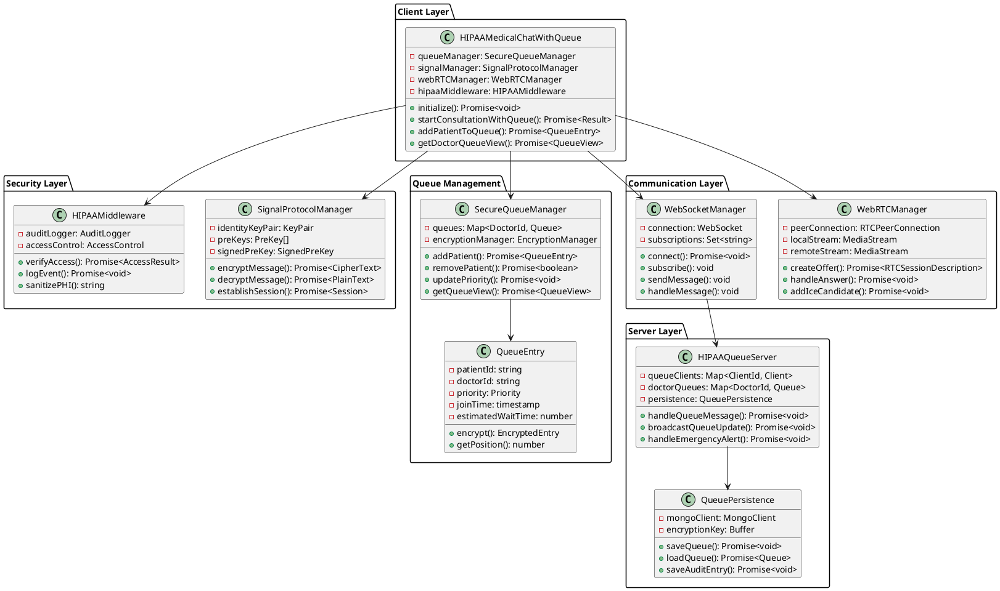

## 2. Class Diagrams

### 2.1 Core Medical Chat System

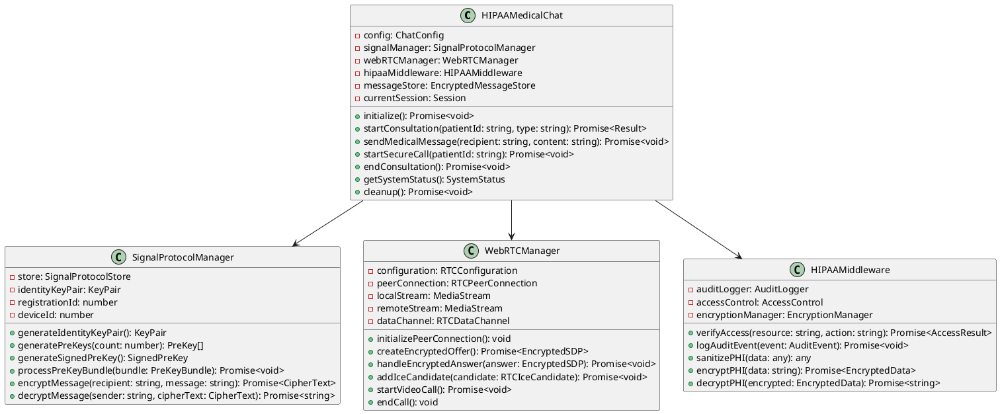

### 2.2 Queue Management System

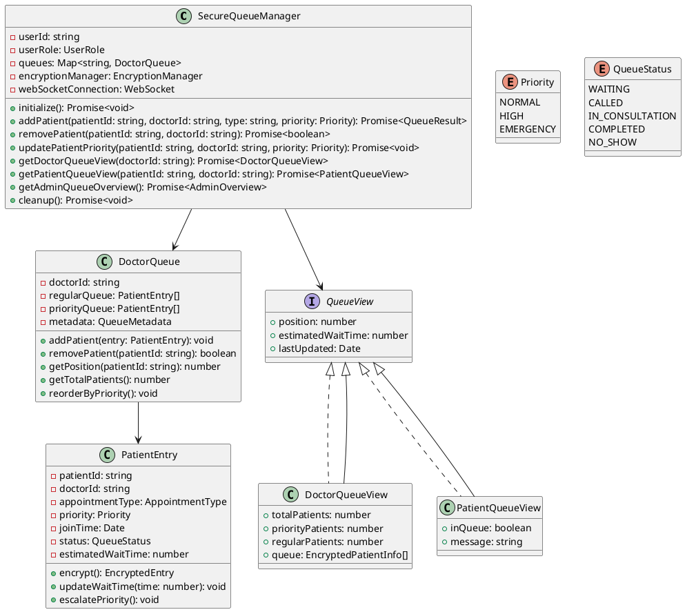

## 3. Sequence Diagrams

### 3.1 Patient Queue Entry and Consultation Flow

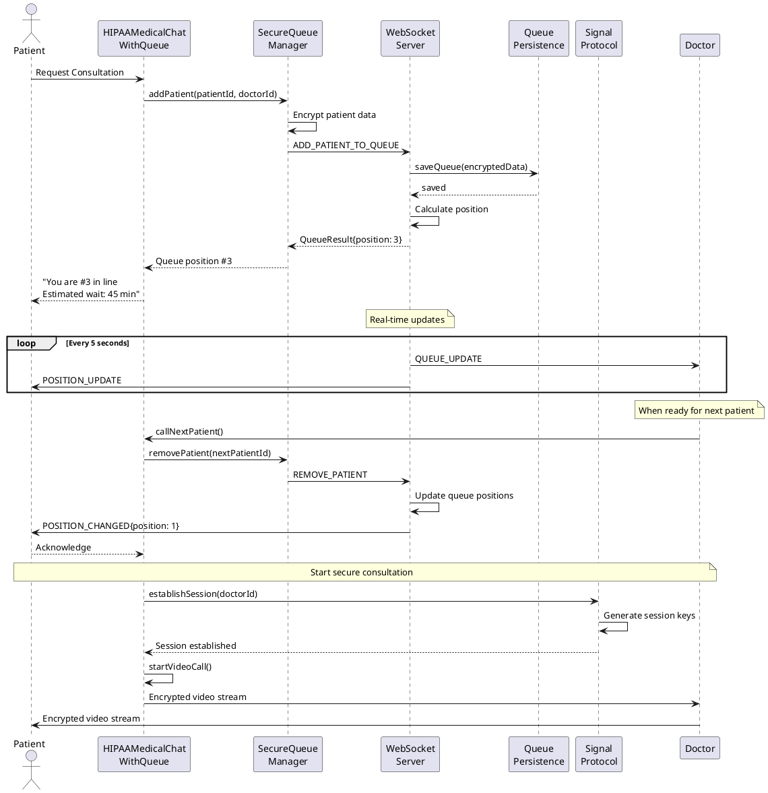

### 3.2 Emergency Priority Escalation

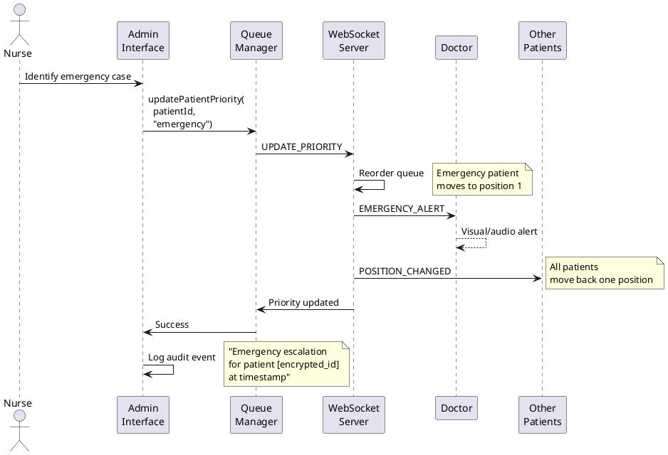

### 3.3 Message Encryption Flow

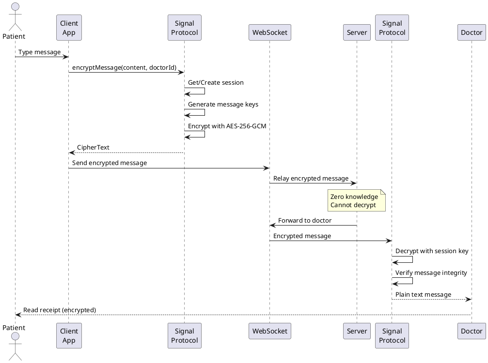

## 4. State Diagrams

### 4.1 Patient Queue State Machine

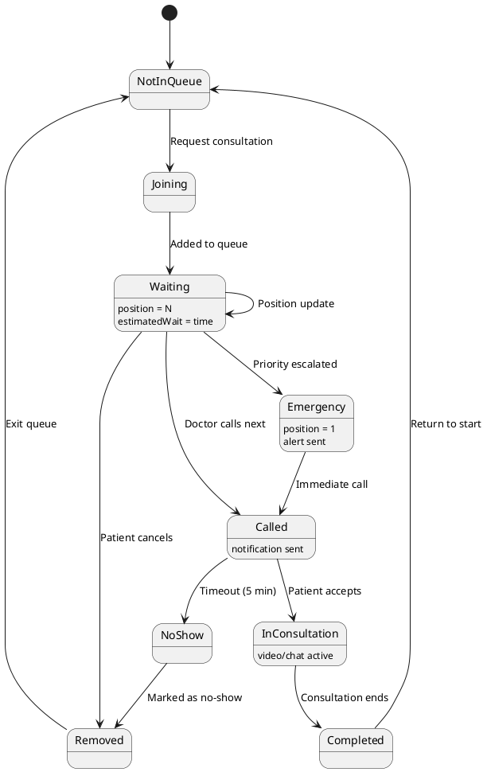

### 4.2 WebRTC Connection Lifecycle

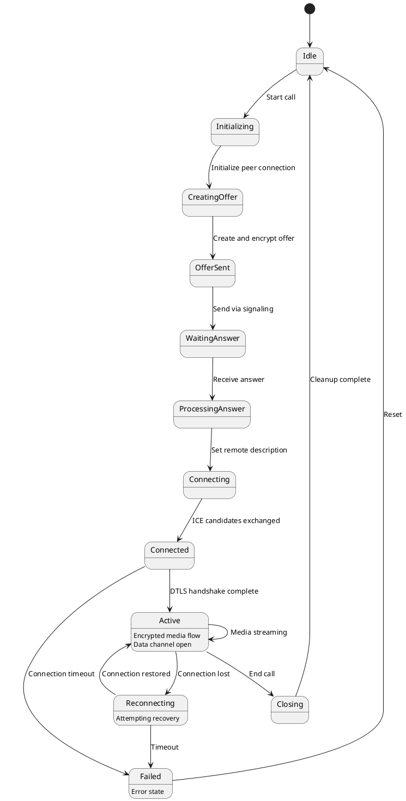

### 4.3 Message Encryption State

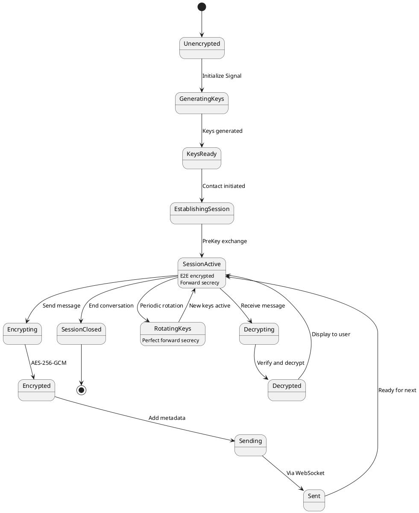

## 5. Data Flow Diagrams

### 5.1 Level 0 - System Context

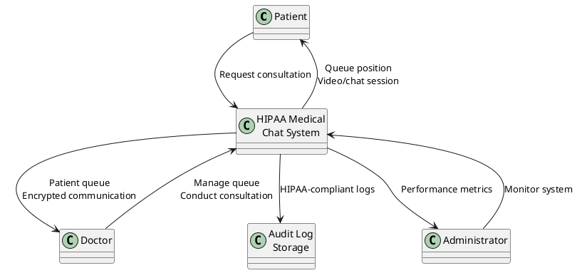

### 5.2 Level 1 - Major Processes

```plantuml
@startuml
!define RECTANGLE class

RECTANGLE "1.0\nAuthentication\nProcess" as Auth {
}

RECTANGLE "2.0\nQueue\nManagement" as Queue {
}

RECTANGLE "3.0\nEncryption\nProcess" as Encrypt {
}

RECTANGLE "4.0\nCommunication\nProcess" as Comm {
}

RECTANGLE "5.0\nAudit\nProcess" as Audit {
}

RECTANGLE "User\nDatabase" as UserDB {
}

RECTANGLE "Queue\nDatabase" as QueueDB {
}

RECTANGLE "Audit\nDatabase" as AuditDB {
}

actor User

User --> Auth : Credentials
Auth --> UserDB : Verify
UserDB --> Auth : User info
Auth --> Queue : Authorized user

User --> Queue : Queue request
Queue --> QueueDB : Update queue
QueueDB --> Queue : Queue state
Queue --> User : Position update

Queue --> Encrypt : Patient data
Encrypt --> Comm : Encrypted data

User --> Comm : Messages/Video
Comm --> Encrypt : Encrypt/Decrypt
Encrypt --> Comm : Processed data
Comm --> User : Secure communication

Auth --> Audit : Access logs
Queue --> Audit : Queue events
Comm --> Audit : Communication logs
Audit --> AuditDB : Store logs

@enduml
```

## 6. Database Schema

### 6.1 MongoDB Collections

```javascript
// Users Collection
{
  _id: ObjectId,
  userId: String (encrypted),
  role: "doctor" | "patient" | "admin",
  publicKey: String,
  identityKey: String,
  registrationId: Number,
  createdAt: Date,
  lastActive: Date
}

// Queues Collection
{
  _id: ObjectId,
  doctorId: String (encrypted),
  queue: {
    priority: [
      {
        patientId: String (encrypted),
        appointmentType: String,
        priority: "emergency",
        joinTime: Date,
        estimatedWaitTime: Number
      }
    ],
    regular: [
      {
        patientId: String (encrypted),
        appointmentType: String,
        priority: "normal" | "high",
        joinTime: Date,
        estimatedWaitTime: Number
      }
    ]
  },
  metadata: {
    created: Date,
    lastUpdated: Date,
    totalServed: Number
  }
}

// Messages Collection (Encrypted)
{
  _id: ObjectId,
  conversationId: String,
  senderId: String (hashed),
  recipientId: String (hashed),
  encryptedContent: Binary,
  messageType: "text" | "file" | "system",
  timestamp: Date,
  delivered: Boolean,
  read: Boolean
}

// Audit Logs Collection
{
  _id: ObjectId,
  eventType: String,
  userId: String (hashed),
  action: String,
  resource: String,
  timestamp: Date,
  metadata: {
    // No PHI stored here
    userRole: String,
    ipAddress: String (hashed),
    sessionId: String
  }
}

// Sessions Collection
{
  _id: ObjectId,
  sessionId: String,
  participants: [String], // Hashed IDs
  sessionType: "consultation" | "emergency",
  startTime: Date,
  endTime: Date,
  encryptedMetadata: Binary
}
```

## 7. Security Architecture

### 7.1 Encryption Layers

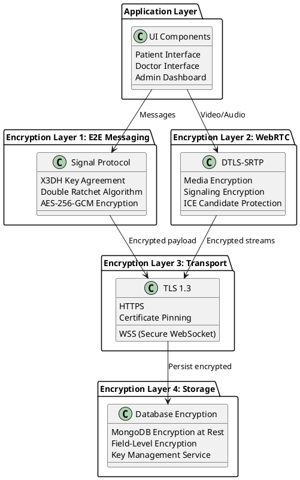

### 7.2 Zero-Knowledge Architecture

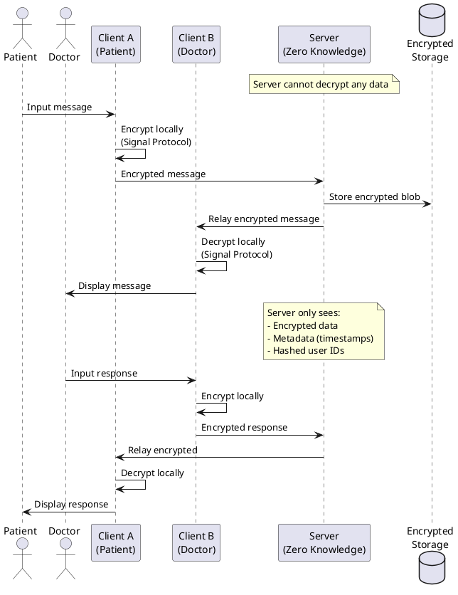

## 8. Deployment Architecture

```plantuml
@startuml
!define RECTANGLE class

cloud "AWS Cloud" {
  package "Public Subnet" {
    RECTANGLE "Application\nLoad Balancer" as ALB {
    }
    
    RECTANGLE "CloudFront\nCDN" as CDN {
    }
  }
  
  package "Private Subnet 1" {
    RECTANGLE "Node.js\nApp Server 1" as App1 {
      Medical Chat App
      Queue Manager
    }
    
    RECTANGLE "WebSocket\nServer 1" as WS1 {
      Queue Updates
      Real-time Messages
    }
  }
  
  package "Private Subnet 2" {
    RECTANGLE "Node.js\nApp Server 2" as App2 {
      Medical Chat App
      Queue Manager
    }
    
    RECTANGLE "WebSocket\nServer 2" as WS2 {
      Queue Updates
      Real-time Messages
    }
  }
  
  package "Data Subnet" {
    database "MongoDB\nReplica Set" as Mongo {
      Primary
      Secondary 1
      Secondary 2
    }
    
    RECTANGLE "Redis\nCluster" as Redis {
      Session Store
      Queue Cache
    }
  }
  
  package "Management" {
    RECTANGLE "Monitoring\n(CloudWatch)" as Monitor {
    }
    
    RECTANGLE "Audit Logs\n(S3)" as Logs {
    }
  }
}

actor Users

Users --> CDN : HTTPS
CDN --> ALB : Cached/Dynamic
ALB --> App1 : Load balanced
ALB --> App2 : Load balanced
App1 --> Mongo : Encrypted data
App2 --> Mongo : Encrypted data
App1 --> Redis : Sessions
App2 --> Redis : Sessions
WS1 --> Redis : Pub/Sub
WS2 --> Redis : Pub/Sub

App1 --> Monitor : Metrics
App2 --> Monitor : Metrics
App1 --> Logs : Audit events
App2 --> Logs : Audit events

@enduml
```

## 9. Performance Considerations

### 9.1 Scalability Metrics
- **Horizontal Scaling**: Add app servers for every 1000 concurrent users
- **Database Sharding**: Shard by doctor ID for queues, by conversation ID for messages
- **Cache Strategy**: Redis for session data, queue positions, recent messages
- **CDN Usage**: Static assets, client-side JavaScript libraries

### 9.2 Optimization Strategies
1. **Message Batching**: Combine multiple queue updates in single WebSocket frame
2. **Connection Pooling**: Maintain persistent database connections
3. **Lazy Loading**: Load patient history on-demand
4. **Compression**: Enable gzip for all HTTP responses
5. **Index Optimization**: MongoDB indexes on frequently queried fields

## 10. Monitoring and Observability

### 10.1 Key Performance Indicators (KPIs)
- Queue update latency (target: <100ms)
- WebSocket connection stability (target: >99.9%)
- Message encryption time (target: <50ms)
- Video call setup time (target: <5 seconds)
- Database query time (target: <20ms)

### 10.2 Monitoring Stack
```
Application Metrics -> Prometheus -> Grafana Dashboard
Logs -> ELK Stack (Elasticsearch, Logstash, Kibana)
Traces -> Jaeger for distributed tracing
Alerts -> PagerDuty integration
```

---

*This design document provides the complete technical architecture for the HIPAA-compliant medical chat system with queue management.*